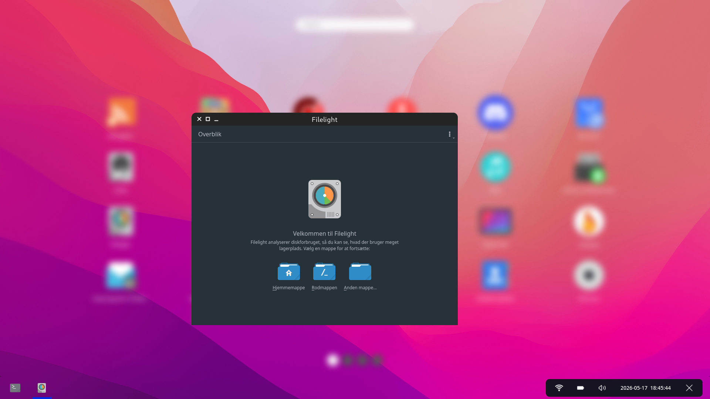
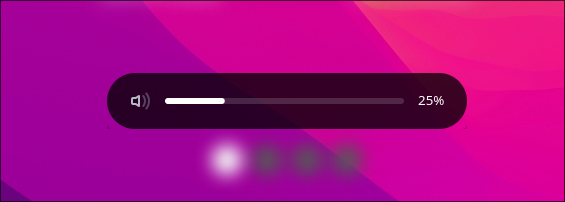

### Work in progress!!

# Introduction
LumenShell is a ChromeOS lookalike Wayland shell featuring Wayfire as compositor and a bunch of small layer shell programs on top. All programs are built on GTK4 + `gtk4-layer-shell` + GSK. All components are implemented in Vala.

# Show case
<table align="center">
  <tr>
    <td colspan="2" align="center">
      <br>
    </td>
  </tr>
  <tr>
    <td align="center">
      <br>
      <sub>status strip</sub>
    </td>
    <td align="center">
      <br>
      <sub>osd</sub>
    </td>
  </tr>
  <tr>
    <td colspan="2" align="center">
      <br>
    </td>
  </tr>
</table>

# Build & install

### 1. Install dependencies

A helper script covers Fedora, Ubuntu/Debian and Arch:

```sh
python3 install_dependencies.py
```
### 2. Configure, build, install

```sh
meson setup build
meson compile -C build
sudo meson install -C build
```

Useful options:

- `-Dwith_desktop_peek=false` — skip the C++ Wayfire plugin (`wayfire-desktop-peek`) if you don't have Wayfire dev headers.
- `--prefix=$HOME/.local` — install to your home instead of the system.

### 3. Run from the build tree (dev)

```sh
source env.sh
./build/lumen-panel
```

### License
GNU General Public License v3.0
