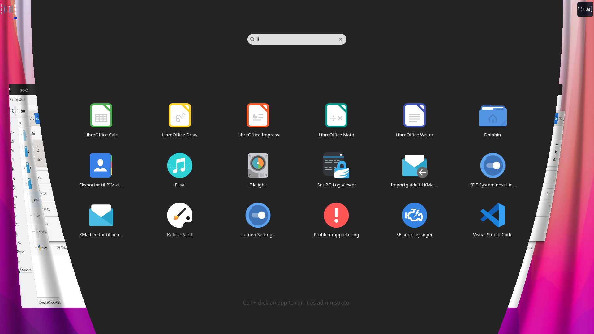
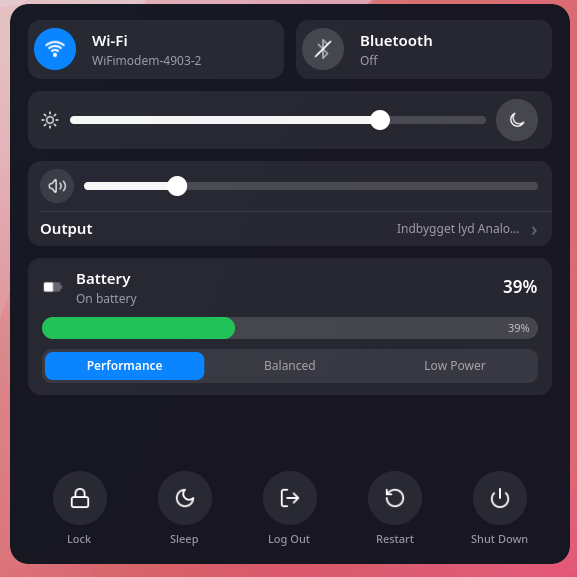
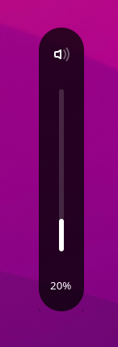
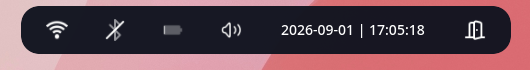

### Work in progress!!

# Introduction
LumenShell is a ChromeOS-inspired desktop shell for Wayland. It uses Wayfire as compositor and a collection of small `gtk4-layer-shell` apps written in Vala, plus a family of C++ Wayfire plugins — all built from a single Meson tree. Graphics are rendered with the Gtk scene graph kit (GSK) and are hardware-accelerated.

# Show case
<table align="center">
  <tr>
    <td colspan="2" align="center">
      <br>
      <sub>app drawer - revealed</sub>
    </td>
  </tr>
  <tr>
    <td align="center" width="50%">
      <br>
      <sub>control center — expanded tray</sub>
    </td>
    <td align="center" width="50%">
      <br>
      <sub>osd — brightness</sub>
      <br><br>
      <br>
      <sub>osd — in vertical position</sub>
    </td>
  </tr>
  <tr>
    <td align="center">
      <br>
      <sub>panel</sub>
    </td>
    <td align="center">
      <br>
      <sub>panel — in different style</sub>
    </td>
  </tr>
  <tr>
    <td colspan="2" align="center">
      <br>
      <sub>panel — tray area</sub>
    </td>
  </tr>
 
</table>

# What's in the repo

The Vala binaries are independent processes; they coordinate through DBus, Wayfire IPC, and shared config files under `~/.config/lumen-shell/` — there is no shared in-process state.

## Shell apps (GTK4 / Vala)

- **`lumen-panel`** — bottom (or top) bar. Left half lists running/pinned app windows; right half is a floating tray area (system tray, WiFi, Bluetooth, Battery, Sound, Clock, Exit) that expands into control center like view
- **`lumen-drawer`** — always-open, bottom-layer app drawer (search bar + paginated tile grid). Hidden by default. it is revealed by a Wayfire peek plugin.
- **`lumen-desktop (still draft)`** — the desktop widget layer: a bottom-layer surface above the wallpaper and below every window, hosting persistent widgets. Ships a Miller-column file browser; configured per widget instance in `~/.config/lumen-shell/desktop.json`.
- **`lumen-osd`** — DBus-driven on-screen display pill (volume, brightness, mic, caps-lock, display, custom). Also self-watches sysfs for hardware key changes.
- **`lumen-notifications`** — `org.freedesktop.Notifications` server. Top-right banner stack with click-to-dismiss and "Clear all".
- **`lumen-lockscreen`** — invisible-until-locked daemon. Locks the session via `ext-session-lock-v1`, authenticates with PAM, respects logind lock/sleep, and auto-locks on idle. macOS-style blurred-desktop card. *(Built only when `gtk4-session-lock` + `pam` are present.)*
- **`lumen-session`** — headless session daemon. Re-applies a remembered monitor layout on output hotplug via `wlr-output-management-v1`.
- **`lumen-settings`** — GTK4/Adwaita config app. Edits the shared config files and restarts the affected binary.

## Command-line helpers

- **`lumen-osdctl`** — CLI to trigger OSD events (volume/brightness/mic/caps-lock/custom, plus Win+P display-mode switching).
- **`lumen-lockctl`** — CLI to lock/unlock/query the lock screen over DBus. *(Built alongside `lumen-lockscreen`.)*

## Wayfire plugins (C++)

C++ `shared_module`s, each gated by a Meson option. IPC verbs are exposed through Wayfire's `ipc` plugin.

- **`wayfire-desktop-peek`** — slides workspace windows toward the corners to peek the desktop (Win+D).
- **`wayfire-curtain-peek`** — freezes a screenshot and splits it apart like curtains to reveal the live desktop grid (Win+S).
- **`wayfire-slide-peek`** — slides the foreground off one edge while the desktop grid slides in from the opposite edge.
- **`wayfire-startup-zoom`** — one-shot zoom-from-center of all initial views on boot.
- **`wayfire-default-focus`** — keeps keyboard focus on a designated layer-shell surface when no toplevel is focused.

## Support library

- **`wlhooks`** — Wayland helper library in C. Implements several Wayland protocols on GTK's existing `wl_display`: foreign-toplevel-management (open-window info), xdg-activation, wlr-output-management, ext-idle-notify, and wlr-screencopy.

# Build & install

### 1. Install dependencies

A helper script covers Fedora, Ubuntu/Debian and Arch:

```sh
python3 install_dependencies.py
```

### 2. Configure, build, install

```sh
meson setup build
meson compile -C build
sudo meson install -C build
```

Useful options:

- `-Dwith_desktop_peek=false` — skip a C++ Wayfire plugin if you don't have Wayfire dev headers. The same applies to `with_curtain_peek`, `with_slide_peek` and `with_startup_zoom`.
- `-Dwith_panel_peek=false` — build a standalone panel with no Wayfire coupling.
- `-Dwith_lockscreen=disabled` — skip the lock screen (otherwise built automatically when `gtk4-session-lock` + `pam` are available).
- `--prefix=$HOME/.local` — install to your home instead of the system.

### 3. Run from the build tree (dev)

`meson devenv` exports the `LUMEN_*` resource/theme variables and pins the GSK renderer, so build-tree binaries find their themes and resources without installing:

```sh
meson devenv -C build ./lumen-panel
```

Or drop into a subshell with `./build` on `PATH`:

```sh
meson devenv -C build
lumen-panel
```

### License
GNU General Public License v3.0
